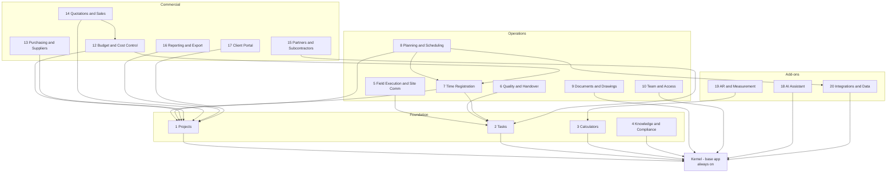
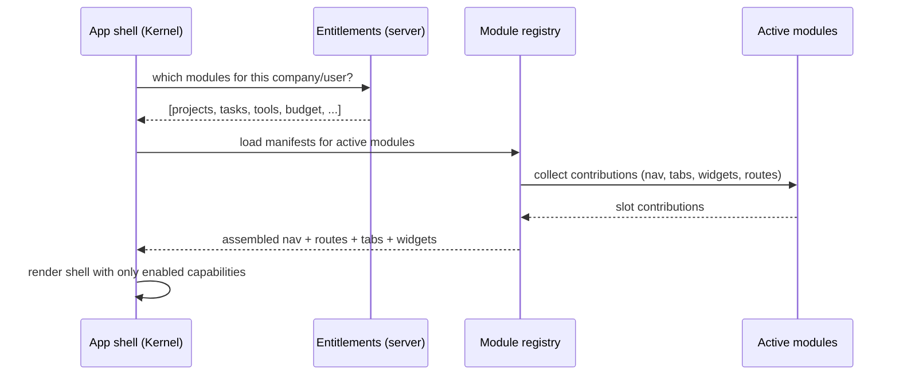
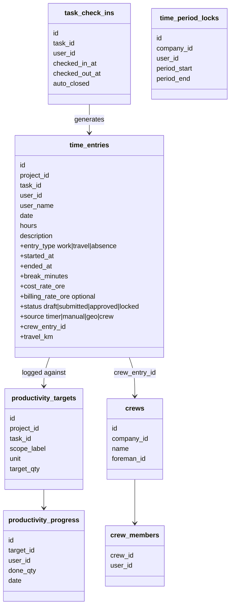
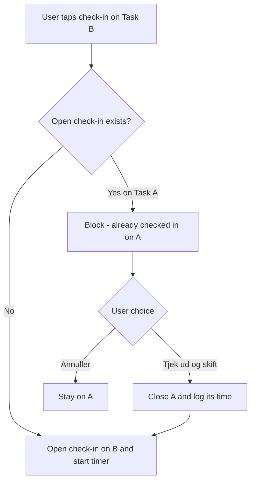
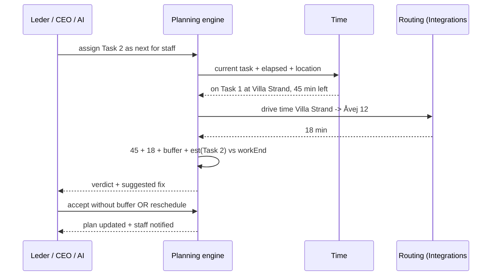

# BygSmart — Master PRD & Modularization Spec (v1.0, shareable)

# BygSmart — Master PRD & Modularization Specification

**Document type:** Product Requirements Document (PRD) + Technical Specification
**Version:** 1.0 (consolidated, shareable)
**Status:** Discovery / proposition — **nothing is executed or changed in the codebase.** This is an initial project proposition intended to become an implementation plan.
**Owner:** BygSmart
**Audience:** product/engineering agent tasked with refining this into a build-ready plan.

<user_quoted_section>How to use this document: It is self-contained. Sections 1–6 are the PRD (why/what). Sections 7–12 are the specification (how). Sections 13–16 are module deep-dives. Section 17 is the decision log (all locked). Section 18 lists open questions to refine. Appendix A is the full calculator inventory. All prices are illustrative placeholders (DKK) — real numbers to be set by BygSmart.</user_quoted_section>

## 1. Executive summary

BygSmart is a feature-rich **construction-management PWA** (React 18 + TypeScript + Vite + Supabase + Node/Express + Stripe + Gemini AI). It has grown into a powerful but "kitchen-sink" monolith: ~35 pages, a project hub with 11 tabs, ~90 calculators, on-site task workspace, economy, documents, team/partner collaboration, AI, AR, billing, and an admin back-office — all delivered flat to every user.

**The problem:** high power, high cognitive load. It's hard to understand, hard to onboard into, and hard to sell "small first."

**The solution:** evolve into a **modular monolith** — one deployable app split internally into a small **Core Platform (Kernel)** plus **19 activatable feature modules**. Each module is both a *code boundary* and a *product capability* toggled per company via an **entitlement-driven module registry**. New companies start with the Kernel + 1–2 modules and grow by switching modules on. This is an **evolution, not a rewrite** — the app already lazy-loads every route and already gates by subscription tier and per-tool access; we formalize those into module boundaries.

**Commercial model:** **per-seat base + per-CVR modules + per-GB storage** (à la carte), mapped onto Stripe subscription items.

## 2. Goals & non-goals

### 2.1 Goals

1. **Start simple, grow by modules** — a new company faces a lean, comprehensible app; capability appears only as it opts in.
2. **One deployable, strong boundaries** — modular monolith, not microservices.
3. **Entitlement-driven, server-authoritative** — active modules resolved server-side, never trusted from the client.
4. **Self-assembling UI** — navigation, home widgets, project tabs, settings sections, and search sources are *contributed by modules* into shared "slots," not hard-coded.
5. **Explicit dependencies only** — a module uses the Kernel and its *declared* dependencies; enforced by lint boundaries.
6. **Non-destructive migration** — move code behind boundaries incrementally; deep links and data keep working.
7. **Commercial flexibility** — price and package modules per segment (solo vs. contractor vs. business).

### 2.2 Non-goals (explicitly out of scope)

- **No payroll.** BygSmart records time, cost, and productivity — it does **not** produce payslips, wage codes, akkord pay settlement, or payroll exports.
- **No microservices split** — the backend stays a single Supabase + single Express app.
- **No rewrite** — existing features are relocated behind boundaries, not rebuilt from scratch.
- **No Module Federation at launch** — deferred (see §17).

## 3. Personas

| Persona | DK term | Role ID | Needs |
| --- | --- | --- | --- |
| Owner / Master | Mester / Ejer | `OWNER` | Everything: projects, team, billing, financials, rate config |
| Project manager / Foreman | Formand / Projektleder | `MANAGER` | Run sites, assign & approve, crew time, plan the day |
| Worker | Svend / Medarbejder | `EMPLOYEE` | See tasks, log own time, document, check in/out |
| Subcontractor | Underentreprenør | `EXTERNAL` | Delegated tasks, negotiation, scoped view |
| Client | Bygherre | `CLIENT` | Read-only progress, handover reports — no financials |

*(Roles already exist as **`UserRole`** in *file:types.ts*.)*

## 4. Current-state summary (what exists today)

**Stack:** React 18 + TS + Vite 6 + Tailwind v4; Supabase (Postgres 17 + Auth + Storage); Node/Express API proxy; Stripe; Google Gemini; Sentry; PWA service worker; Three.js/react-three-fiber for AR.

**Key facts that make modularization feasible:**

- Every route is already **lazy-loaded** in file:App.tsx.
- **Server-authoritative access** already exists for calculators: file:services/toolAccess.ts + file:contexts/ToolAccessProvider.tsx — the exact pattern to promote to per-module entitlements.
- **Tiering** already exists: file:config/subscriptionPlans.ts (`PlanLimits`, `PRO_TOOLS_IDS`), file:contexts/SubscriptionContext.tsx.
- Domain-shaped folders already emerged: `components/project`, `components/tasks`, `components/taskWorkspace`, `components/partner`, `components/calculators`, `components/admin`, `components/modules/RoomMapper`.
- Time/cost primitives already exist: `time_entries` (file:services/api/timeEntries.ts), geo `task_check_ins` (file:services/taskWorkspace/checkIn.ts), labor cost in `get_project_budget_summary` (file:services/api/budget.ts).

**Signals modularization is overdue:** hard-coded nav (file:components/BottomNavBar.tsx), fixed 11 project tabs (file:pages/ProjectDetailPage.tsx), ~90 hand-written calculator routes in file:App.tsx, and pervasive cross-domain imports.

## 5. Product vision & principles

1. **Glanceable first** — a builder with gloves gets the answer in 3 seconds.
2. **The app you need, nothing you don't** — modules you haven't enabled are invisible.
3. **Grow-with-you** — enabling a module *is* the upgrade moment.
4. **Team-visible** — presence, activity, handovers, and communication are first-class.
5. **Server-authoritative** — the client renders what the entitlement set allows.
6. **Backward-compatible** — deep links, data, and history always keep working.

## 6. Growth path & packaging (start simple → grow)

| Stage | Persona | Modules active (on top of Kernel) |
| --- | --- | --- |
| **Start** | DIY / solo | Calculators + Knowledge (+ 1 Project, basic Tasks) |
| **Håndværker** | Tradesperson + small crew | + Field Execution & Site Comm, Time Registration, Planning, Documents, Team |
| **Virksomhed** | Contractor business | + Budget, Purchasing, Quotations, Partners, Reporting, Client Portal |
| **Add-ons** | Anyone | AI Assistant, AR & Measurement, Integrations & Data |

**Principle:** a company only ever sees navigation, project tabs, and home widgets for modules it has enabled.

## 7. Module architecture (19 active modules + 2 operator)



**Notes:** IDs 1–20 are stable; **#11 is retired** (site communication merged into #5), kept free as headroom. Operator modules (always installed, never sold): **Billing & Subscriptions**, **Platform Admin & Insights**.

## 8. The Kernel (base app) — always on

Every company pays the per-seat base fee for the Kernel. Nothing here is optional.

- Identity & security: login/register/reset, MFA/TOTP, Turnstile (file:contexts/AuthProvider.tsx, file:components/auth)
- Organization & accounts: company/CVR, profiles, RBAC foundation, connections
- App shell: **registry-driven** nav rail + bottom nav + top bar (replaces hard-coded `NAV_ITEMS` in file:components/BottomNavBar.tsx)
- Notification center: in-app bell, push, preferences (file:services/notifications.ts, file:services/pushNotifications.ts)
- Settings foundation, legal/GDPR, design system (file:components/ui)
- **Module registry + entitlement engine** (the modularity core)
- Onboarding & the **"Udvid din BygSmart"** module marketplace

## 9. Module catalog (features · dependencies · pricing class)

Legend — **Dep** = required modules · **Class** = Start / Team / Business / Add-on.

### Foundation

**1. Projects (Projekter)** — *Dep: — · Class: Start.* Project list & hub, overview, details, status/progress, lifecycle, members, activity feed, project-health card. **Owns the project-tab slot.** *(*file:pages/ProjectsPage.tsx*, *file:pages/ProjectDetailPage.tsx*, *file:services/projects.ts*)*

**2. Tasks (Opgaver)** — *Dep: — · Class: Start.* Create/assign, statuses, priorities, checklists, dependencies, milestones; list/group/split/kanban; global task list; quick tasks. *(*file:components/tasks*, *file:services/tasks.ts*, *file:services/quickTasks.ts*)*

**3. Calculators & Tools (Beregnere)** — *Dep: — · Class: Start + Pro tools.* ~89 calculators in 16 categories + shell, help/standards, basic⇄advanced modes, save-to-project, PDF export, per-tool campaigns. See Appendix A. *(*file:pages/calculators*, *file:services/calculatorCatalog.ts*)*

**4. Knowledge & Compliance (Viden & Reglement)** — *Dep: — · Class: Start.* BR18/SBI/DS/AB18/AT library, building guides, regulation detail + AI explanations, scoped search. *(*file:services/regulations.ts*, *file:pages/SearchPage.tsx*)*

### Operations

**5. ⭐ Field Execution & Site Communication (Udførelse & Kommunikation)** — *Dep: Tasks · Class: Team · flagship focus.* The on-site heart of the app — **execution + best-in-class site communication in one place**:

- On-site task workspace: geo check-in/out, on-site documentation (photo/audio/file/notes), offline-first capture *(*file:services/taskWorkspace*)*
- **Site chat & threads** with @mentions, photo/voice replies, read receipts, unread markers *(*file:services/taskChat.ts*, *file:components/project/tabs/TaskChatTab.tsx*)*
- **Team presence** (who's checked in now) & per-task activity/attribution
- **Announcements / toolbox-talks** to a project or crew, with acknowledge
- Push + notification-center integration
- **Excellence goal:** fast, reliable, glove-friendly communication that keeps the whole crew in sync — a priority quality bar.

**6. Quality & Handover (KS & Aflevering)** — *Dep: Tasks · Class: Team.* Quality control/KS with deviations & corrective actions, punch/mangelliste with pins on drawings, handover ceremony with signatures + acceptance report. *(*file:services/taskQualityControl.ts*, *file:services/punchList.ts*, *file:services/taskWorkspace/handover.ts*)*

**7. ⭐ Time Registration (Tidsregistrering) — payroll-free** — *Dep: Tasks, Projects · Class: Team.* Time consumed, what it was spent on, non-payroll productivity vs target, and cost of time feeding budget-burn. Full deep-dive in §13.

**8. ⭐ Planning & Scheduling (Plan) — with smart day-planning** — *Dep: Projects; uses Time #7, Integrations #20 · Class: Team.* Gantt/calendar/reminders/follow-ups + intelligent scheduling & travel-time feasibility. Full deep-dive in §14. *(*file:components/planning*, *file:services/reminders.ts*, *file:services/followUp.ts*)*

**9. Documents & Drawings (Dokumenter)** — *Dep: — · Class: Team.* Document management: categories, drawing disciplines, revisions, access levels; shared file-attachment service; cloud-drive browsing **when Integrations is active**. Primary storage driver. *(*file:services/documents.ts*, *file:components/CloudFileBrowser.tsx*)*

**10. Team & Access (Team & Adgang)** — *Dep: — · Class: Team.* Team management & seats, invites (link/QR/e-mail), connections/network, presence & attribution on cards. *(*file:pages/TeamManagementPage.tsx*, *file:pages/TeamInvitePage.tsx*)*

### Commercial

**12. Budget & Cost Control (Budget)** — *Dep: Projects (optional Time) · Class: Business.* Baseline, revisions, forecast, **budget-burn** summary; consumes labor actuals from Time #7 and material actuals from Purchasing. *(*file:services/budget.ts*)*

**13. Purchasing & Suppliers (Indkøb)** — *Dep: Projects · Class: Business.* Purchases, suppliers, vendor catalog, delivery tracking. *(*file:services/purchases.ts*, *file:services/suppliers.ts*)*

**14. Quotations & Sales (Tilbud)** — *Dep: Projects (optional Budget) · Class: Business.* Quotations/tilbud with line items, VAT, statuses. *(*file:services/quotations.ts*)*

**15. Partners & Subcontractors (Partnere)** — *Dep: Tasks · Class: Business.* Partner invites & negotiation (offers/counter-offers/chat), unified project resources, scoped partner view, delegation reporting. *(*file:components/partner*, *file:services/partners.ts*, *file:services/projectResources.ts*)*

**16. Reporting & Export (Rapporter)** — *Dep: Projects · Class: Business.* PDF reports (acceptance/handover/project/quotation/intelligence), Excel/CSV export, report branding. *(*file:services/pdfReport*, *file:components/project/reports*)*

**17. Client / Bygherre Portal (Kunde-portal)** — *Dep: Projects · Class: Business.* Read-only external stakeholder access: scoped timeline, handover reports, progress — no financials/internal comments (builds on the CLIENT role & `PartnerProjectView` scoping in file:types.ts).

### Add-ons

**18. AI Assistant & Intelligence (AI)** — *Dep: — · Class: Add-on (metered).* Chat + hands-free/TTS, multi-provider gateway, daily/advanced briefings, project & onboarding intelligence, AI report generation, **schedule optimization for #8**. *(*file:contexts/ChatProvider.tsx*, *file:supabase/functions/ai-gateway*)*

**19. AR & Measurement (AR & Opmåling)** — *Dep: Calculators · Class: Add-on.* RoomMapper 3D capture + AR measurement → send to calculator / save as room. *(*file:components/modules/RoomMapper*, *file:pages/calculators/MeasurementTool.tsx*)*

**20. Integrations & Data (Integrationer)** — *Dep: — · Class: Add-on.* Connector framework: cloud storage OAuth (Google/Dropbox/OneDrive/Box), **maps & routing (distance-matrix for smart planning #8)**, accounting export (e-conomic/Dinero/Billy), SMTP. **No payroll.** *(*file:services/integrationAuth.ts*, *file:services/cloudProviders.ts*, *file:server/smtpRoutes.js*)*

### Operator modules (always installed, invisible to customers)

- **Billing & Subscriptions** — Stripe checkout/portal/webhook, module entitlement mapping, promo/trial codes. *(*file:supabase/functions/stripe-webhook*, *file:server/billingSync.js*)*
- **Platform Admin & Insights** — users/companies/teams, revenue/delegation insights, **module-adoption analytics**. *(*file:pages/AdminDashboardPage.tsx*, *file:components/admin*)*

## 10. Technical architecture

### 10.1 Folder structure — feature-first

```text
src/
  core/                     # Kernel: shell, auth, entitlements, registry, ui kit, notifications
    registry/               # module registry + slot system
    entitlements/           # resolves active modules per company (server-authoritative)
    shell/                  # AppScreen, nav rail, bottom nav, top bar, home host
  modules/
    projects/ tasks/ tools/ knowledge/ field-comm/ quality/ time/ planning/
    documents/ team/ budget/ purchasing/ quotations/ partners/ reporting/
    client-portal/ ai/ ar/ integrations/
      <module>/
        manifest.ts         # id, name, icon, routes, nav, tabs, deps, entitlement
        routes.tsx          # lazy-loaded routes
        components/ services/ stores/ hooks/ types.ts
        index.ts            # the module's ONLY public surface
  shared/                   # cross-module types/utilities with zero business logic
```

### 10.2 Module manifest (the contract) — illustrative shape

```ts
export const manifest: ModuleManifest = {
  id: 'budget', requires: ['projects'], entitlement: 'module.budget',
  nav: [{ to: '/budget', label: 'Økonomi', icon: WalletIcon }],
  projectTabs: [{ id: 'budget', label: 'Budget', load: () => import('./tabs/Budget') }],
};
```

### 10.3 Registry + "slot" model (how the UI self-assembles)

Modules contribute into named slots; the shell renders whatever active modules registered:

- `nav` → replaces hard-coded `NAV_ITEMS` (file:components/BottomNavBar.tsx, file:components/NavRail.tsx)
- `projectTabs` → replaces the fixed 11 tabs (file:pages/ProjectDetailPage.tsx)
- `homeWidgets` → drives the modular home (§12)
- `settingsSections`, `searchSources`, `quickActions`, `calculators`



### 10.4 Boundary rules

- A module imports only `core/`, `shared/`, and its **declared** dependencies' `index.ts`.
- No deep cross-module imports (enforced via ESLint import-boundary rules).
- Cross-module links go through the registry (route ids), not direct component imports.

### 10.5 Backend & data alignment

- Single Supabase + single Express app (modular monolith). Assign **table & route ownership per module** (route files already trend this way in file:server/routes).
- Group RLS policies and migrations by owning module.
- The **entitlement resolver** extends the proven file:services/toolAccess.ts pattern from per-tool to per-module.

### 10.6 Runtime activation & interoperability (two guarantees)

**Q1 — Add modules without reboot?**

- **Case A — activate/deactivate an already-shipped module: runtime, instant, no reboot.** Entitlement change; registry re-assembles nav/tabs/routes/widgets live. Supabase realtime can flip it without a page reload.
- **Case B — ship a brand-new module's code: needs a zero-downtime deploy** (compiled Vite/PWA bundle); users get a silent service-worker update, not a reboot. Migrations run idempotently.
- **Module Federation** (true runtime code plug-ins) is **deferred** — revisit post-launch.

**Q2 — Do earlier + later modules work together? Yes, by design:**

1. Talk only through Kernel **contracts + slots**, never deep imports.
2. Declared dependencies + resolution on activation.
3. Idempotent, additive migrations (a module owns its tables/columns).
4. Capability detection / graceful degradation.
5. Backward-compatible, versioned contracts.

Examples: enable **Integrations** later → **Documents** gains cloud sync; enable **Budget** later → **Time** history flows into cost actuals; enable **Quality** later → KS/punch/handover tabs appear on existing tasks.

### 10.7 Migration approach (non-destructive, incremental)

1. **Kernel first:** stand up `core/` (registry + entitlements + slots) with all modules "always on" → zero behavior change.
2. **Strangler moves:** relocate one domain at a time behind its `index.ts`, starting with **Calculators** (most self-contained); convert hard-coded routes/tabs/nav into slot contributions.
3. **Flip the switch:** enable per-company module toggles; keep old `?tab=` deep links redirecting.
4. **Operator last:** wire Billing entitlements → activation, and Admin module-adoption analytics.

## 11. Commercial model — pricing & packaging

### 11.1 Billing units (locked)

- **Base = per seat (user).** Flat seat fee for Kernel access. Placeholder **100 kr./md./bruger**.
- **Modules = per CVR (company), flat.** Each activated module a flat per-company fee, independent of user count. Placeholder **50 kr./md./modul**.
- **Storage = per GB block** above a base allowance. Placeholder **50 kr./md./GB**.
- **AI = metered** token pool (usage-based).
- **Bundles (optional):** Start / Team / Business discounted pre-selections; à la carte is default.

### 11.2 Pricing units matrix

| # | Item | Default unit | Placeholder | Best-practice option |
| --- | --- | --- | --- | --- |
| — | Base app (Kernel) | Per seat | 100 kr./md. | Only per-user charge by default |
| 1 | Projects | Per CVR | 50 | Foundation |
| 2 | Tasks | Per CVR | 50 | Foundation |
| 3 | Calculators & Tools | Per CVR | 50 | Option: per-seat if used widely |
| 4 | Knowledge & Compliance | Per CVR | 50 | — |
| 5 | Field Execution & Site Comm | Per CVR | 50 | Option: per-seat (crew scale) |
| 6 | Quality & Handover | Per CVR | 50 | — |
| 7 | Time Registration | Per CVR | 50 | **Recommend per-seat** (value ∝ users) |
| 8 | Planning & Scheduling | Per CVR | 50 | — |
| 9 | Documents & Drawings | Per CVR | 50 | Primary storage driver |
| 10 | Team & Access | Per CVR | 50 | — |
| 12 | Budget & Cost Control | Per CVR | 50 | — |
| 13 | Purchasing & Suppliers | Per CVR | 50 | — |
| 14 | Quotations & Sales | Per CVR | 50 | — |
| 15 | Partners & Subcontractors | Per CVR | 50 | Option: premium price |
| 16 | Reporting & Export | Per CVR | 50 | — |
| 17 | Client / Bygherre Portal | Per CVR | 50 | Guest (bygherre) seats free |
| 18 | AI Assistant | Metered | usage | Optional small activation fee |
| 19 | AR & Measurement | Per CVR | 50 | — |
| 20 | Integrations & Data | Per CVR | 50 | Option: premium price. No payroll. |
| — | Storage | Per GB block | 50 kr./md./GB | Above base allowance |

### 11.3 Storage accounting

- **Base allowance:** proposal **1 GB per seat, pooled per CVR** (alt: flat 5 GB/CVR).
- **Top-up:** 1 GB blocks at 50 kr./md./GB.
- **Drivers:** Documents (#9), Field Exec photos/audio (#5), Quality deviation photos (#6), task docs, PDF reports (#16), negotiation attachments (#15).
- **Metering:** nightly sum of the CVR's Supabase storage bucket → set Stripe storage item quantity; warn at 80/100%.
- **Enforcement:** soft (warn + prompt to buy), never hard-block site data.

### 11.4 Worked examples (placeholder DKK)

| Scenario | Seats | Modules | Storage | Monthly |
| --- | --- | --- | --- | --- |
| Solo | 1×100 | 2×50 | base | **200 kr.** |
| Small crew | 4×100 | 6×50 | +2 GB (100) | **800 kr.** |
| Business | 12×100 | 12×50 | +10 GB (500) | **2.300 kr.** + AI |

### 11.5 Stripe mapping

- **One Stripe Subscription per CVR** with multiple items: seat item (qty = active users), module items (one per active module), storage item (qty = extra GB), AI metered item.
- Each = a Stripe Product with monthly & yearly Prices (annual discount, e.g. −15%).
- Webhook (file:supabase/functions/stripe-webhook) + file:server/billingSync.js map items → the CVR's **entitlement set** (`module.*` flags + storage GB + AI quota).
- file:config/subscriptionPlans.ts evolves into a **module → product/price/limits registry**; file:contexts/SubscriptionContext.tsx from single `tier` to the entitlement set.
- **Seat = an active (accepted, non-terminated) user.** Pending invites don't consume a seat.

## 12. Home page — modular launchpad + module marketplace

The home reflects **only the company's active modules** (`homeWidgets` slot), keeping the Projektledelse / Min Arbejdsdag switch from file:pages/HomePage/index.tsx. The **module marketplace** shows per-module state and a running plan total — the growth/upsell surface.

### 12.1 "Start" home (solo — few modules active)

```wireframe

<html><head><style>
  body{font-family:system-ui,Arial,sans-serif;margin:0;background:#f4f6f8;color:#14202e}
  .wrap{max-width:420px;margin:0 auto;padding:16px 14px 90px}
  .top{display:flex;justify-content:space-between;align-items:center;margin-bottom:14px}
  .hi{font-size:20px;font-weight:800}.date{font-size:12px;color:#5b6b7b}
  .av{width:38px;height:38px;border-radius:50%;background:#1E5FFF;color:#fff;display:flex;align-items:center;justify-content:center;font-weight:700}
  .card{background:#fff;border:1px solid #e3e9ef;border-radius:14px;padding:14px;margin-bottom:12px}
  .lbl{font-size:12px;color:#5b6b7b;font-weight:700;text-transform:uppercase;letter-spacing:.04em;margin-bottom:10px}
  .grid{display:grid;grid-template-columns:1fr 1fr;gap:10px}
  .tile{border:1px solid #e3e9ef;border-radius:12px;padding:14px;text-align:center;font-size:13px;font-weight:600}
  .ic{font-size:22px;display:block;margin-bottom:6px}
  .row{display:flex;justify-content:space-between;align-items:center;padding:10px 0;border-bottom:1px solid #eef2f6;font-size:14px}
  .row:last-child{border-bottom:none}
  .grow{border:1px dashed #1E5FFF;background:#eef4ff}
  .btn{display:inline-block;margin-top:8px;background:#1E5FFF;color:#fff;border-radius:10px;padding:8px 12px;font-size:13px;font-weight:700}
  .nav{position:fixed;bottom:14px;left:50%;transform:translateX(-50%);width:392px;max-width:92%;background:#fff;border:1px solid #e3e9ef;border-radius:40px;display:flex;justify-content:space-around;padding:8px 4px;font-size:11px;color:#5b6b7b}
  .nav b{color:#1E5FFF}
</style></head><body>
  <div class="wrap">
    <div class="top"><div><div class="hi">Godmorgen, Jens</div><div class="date">Tirsdag 9. juli · Start-plan</div></div><div class="av">JN</div></div>
    <div class="card"><div class="lbl">Hurtige værktøjer</div>
      <div class="grid">
        <div class="tile" data-element-id="tool-beton"><span class="ic">🧱</span>Beton & armering</div>
        <div class="tile" data-element-id="tool-areal"><span class="ic">📐</span>Areal & rumfang</div>
        <div class="tile" data-element-id="tool-el"><span class="ic">⚡</span>El & kabel</div>
        <div class="tile" data-element-id="tool-all"><span class="ic">🔎</span>Alle 89 værktøjer</div>
      </div>
    </div>
    <div class="card"><div class="lbl">Mit projekt</div>
      <div class="row"><span>Villa Lærkevej</span><span style="color:#5b6b7b">3 opgaver</span></div>
      <div class="row"><span>Næste: Støb fundament</span><span style="color:#5b6b7b">i morgen</span></div>
    </div>
    <div class="card grow"><div class="lbl" style="color:#1E5FFF">Udvid din BygSmart</div>
      <div style="font-size:13px">Få styr på tid, dokumenter og økonomi når du vokser.</div>
      <span class="btn" data-element-id="explore-modules">Se moduler →</span>
    </div>
  </div>
  <div class="nav"><div><b>Hjem</b></div><div>Projekter</div><div>Scan</div><div>Opgaver</div><div>Værktøj</div></div>
</body></html>
```

### 12.2 Module marketplace (per-seat + per-CVR + storage)

```wireframe

<html><head><style>
  body{font-family:system-ui,Arial,sans-serif;margin:0;background:#f4f6f8;color:#14202e}
  .wrap{max-width:760px;margin:0 auto;padding:20px 16px}
  h1{font-size:22px;margin:0 0 2px}.sub{color:#5b6b7b;font-size:13px;margin-bottom:8px}
  .bar{display:flex;justify-content:space-between;align-items:center;background:#0f2740;color:#fff;border-radius:12px;padding:10px 14px;margin-bottom:16px;font-size:13px}
  .bar b{font-size:16px}
  .grp{font-size:12px;color:#5b6b7b;font-weight:700;text-transform:uppercase;letter-spacing:.04em;margin:16px 0 8px}
  .m{background:#fff;border:1px solid #e3e9ef;border-radius:12px;padding:12px 14px;display:flex;align-items:center;gap:12px;margin-bottom:10px}
  .ic{width:40px;height:40px;border-radius:10px;background:#eef4ff;display:flex;align-items:center;justify-content:center;font-size:20px}
  .txt{flex:1}.txt .n{font-weight:700;font-size:15px}.txt .d{font-size:12px;color:#5b6b7b}
  .price{font-size:12px;color:#0f2740;font-weight:700;margin-right:10px;text-align:right;min-width:96px}
  .tag{font-size:10px;font-weight:700;border-radius:20px;padding:3px 8px;margin-left:6px}
  .t-inc{background:#e7f6ec;color:#1a7f43}.t-add{background:#fff3e6;color:#c2410c}.t-star{background:#eef4ff;color:#1E5FFF}
  .sw{width:44px;height:26px;border-radius:20px;background:#1E5FFF;position:relative}
  .sw.off{background:#c9d3dd}
  .sw span{position:absolute;top:3px;width:20px;height:20px;border-radius:50%;background:#fff;right:3px}
  .sw.off span{left:3px;right:auto}
  .dep{font-size:11px;color:#8a97a5}
</style></head><body>
  <div class="wrap">
    <h1>Moduler & abonnement</h1>
    <div class="sub">Basis pr. sæde (bruger) + moduler pr. CVR + lager pr. GB. Kernen er altid aktiv.</div>
    <div class="bar"><span>5 sæder × 100 kr + 6 moduler × 50 kr/CVR + 2 GB</span><span>Estimeret: <b>800 kr./md.</b> + AI</span></div>
    <div class="grp">Aktive</div>
    <div class="m"><div class="ic">📁</div><div class="txt"><div class="n">Projekter <span class="tag t-inc">Aktiv</span></div><div class="d">Projekt-hub & overblik</div></div><div class="price">Inkluderet</div><div class="sw"><span></span></div></div>
    <div class="m"><div class="ic">⏱️</div><div class="txt"><div class="n">Tidsregistrering <span class="tag t-star">Byggeri</span></div><div class="d">Sjak, tidsforbrug, omkostning, sporbarhed</div></div><div class="price">50 kr./CVR</div><div class="sw"><span></span></div></div>
    <div class="m"><div class="ic">🏗️</div><div class="txt"><div class="n">Udførelse & kommunikation <span class="tag t-inc">Aktiv</span></div><div class="d">Check-in, foto, site-chat, presence</div></div><div class="price">50 kr./CVR</div><div class="sw"><span></span></div></div>
    <div class="grp">Tilføj — vokser med dig</div>
    <div class="m"><div class="ic">🗓️</div><div class="txt"><div class="n">Plan & smart dagsplan</div><div class="d">Gantt, rute-tjek, feasibility</div><div class="dep">Bruger Tid #7 + Integrationer</div></div><div class="price">50 kr./CVR</div><div class="sw off" data-element-id="add-plan"><span></span></div></div>
    <div class="m"><div class="ic">💰</div><div class="txt"><div class="n">Budget & økonomistyring</div><div class="d">Baseline, forecast, budget-burn</div><div class="dep">Bruger timer fra Tidsregistrering</div></div><div class="price">50 kr./CVR</div><div class="sw off" data-element-id="add-bud"><span></span></div></div>
    <div class="m"><div class="ic">🤖</div><div class="txt"><div class="n">AI-assistent <span class="tag t-add">Forbrug</span></div><div class="d">Chat, briefinger, planlægning</div></div><div class="price">forbrug</div><div class="sw off" data-element-id="add-ai"><span></span></div></div>
    <div class="m"><div class="ic">💾</div><div class="txt"><div class="n">Ekstra lager</div><div class="d">Køb i blokke à 1 GB</div></div><div class="price">50 kr./GB</div><div class="sw" data-element-id="add-storage"><span></span></div></div>
  </div>
</body></html>
```

## 13. Deep dive — Module #7 Time Registration (payroll-free)

### 13.1 Scope (locked)

Time registration only — **NO payroll.** Records **time consumed**, **what it was spent on**, a **non-payroll productivity/progress tracker** (target vs actual), and **cost of time** feeding **budget-burn**. **No** payslips, wage codes, or akkord pay settlement. Adds: informational **overtime flag**, **single active check-in guard**, and links to smart planning (#8).

### 13.2 Feature catalog

- **Registration:** clock in/out per project & task (evolves file:components/project/FloatingTimer.tsx), pause/resume, one active timer per user; GPS geofence + auto-close (reuses `task_check_ins`); manual entry & weekly grid; **rounding to nearest 5/15 min** (company setting, raw start/stop kept for audit); offline-first.
- **⭐ Sjak (crew) registration:** saved crews + ad-hoc; one-tap "log for crew" produces individual editable entries; per-member override; crew presence.
- **⭐ Single active check-in guard:** a user **cannot start a second task while a timer is ticking** on another; server-enforced (authoritative open-check-in RPC); blocked attempt offers **one-tap "Tjek ud & skift"** (auto-closes current, opens new).
- **Cost of time & traceability:** cost rate per user/task → cost of time consumed (insight only); auditable per-task "how time was spent" trail (who/how long/when/where); rate resolution: per-task (`task_budget_rates.hourly_rate_dkk`) → project default (`project_budgets.labor_rate_dkk_per_hour`) → company/user default; **feeds Budget #12 burn**. **Cost visibility is per project member** — OWNER keeps a visibility tab; a formand's access to crew cost rates is set via the existing per-project-member `ResourceVisibility` setting.
- **⭐ Productivity vs target (non-payroll):** register target quantity (m²/stk./lb.m, seeded from Calculators #3) and log produced quantity; shows done-vs-target and estimated-vs-actual hours → productivity rate; **strictly no money/settlement**.
- **Travel time (kørsel):** distinct activity type + optional km for the record; feeds smart day-planning (#8); informational only (no godtgørelse payout).
- **Absence (fravær):** sygdom, ferie, feriefridage, barns sygedag, helligdag, afspadsering, kursus; feeds availability for planning; insight only.
- **Approval & period lock:** employee submits → formand/mester approves → period locked (immutable; unlock has audit trail); bulk approve; reject w/ reason.
- **Working-time compliance & overtime flag:** 11-hour rest, weekly-hours warnings; informational OT flag (e.g. >8 h/day) — no OT pay.
- **Reports & export:** hours per project/task/employee/crew, productivity, time-cost summary, absence summary, per-task trail; Excel/CSV (extends `exportTimeEntriesToExcel`) + PDF via Reporting #16. **No wage-code/payroll export.**

### 13.3 Data model (additive)



**Removed with payroll:** `wage_agreements`, `wage_supplement_rules`, `time_entry_supplements`, `akkord_*`, `payroll_exports`.

### 13.4 Switch-task guard flow



### 13.5 Weekly timesheet wireframe

```wireframe

<html><head><style>
 body{font-family:system-ui,Arial,sans-serif;margin:0;background:#f4f6f8;color:#14202e}
 .wrap{max-width:460px;margin:0 auto;padding:16px 14px 90px}
 .top{display:flex;justify-content:space-between;align-items:center;margin-bottom:12px}
 .h{font-size:20px;font-weight:800}.wk{font-size:12px;color:#5b6b7b}
 .sum{display:flex;gap:8px;margin-bottom:12px}
 .s{flex:1;background:#fff;border:1px solid #e3e9ef;border-radius:12px;padding:10px;text-align:center}
 .s .n{font-size:18px;font-weight:800}.s .t{font-size:11px;color:#5b6b7b}
 .day{background:#fff;border:1px solid #e3e9ef;border-radius:12px;padding:10px 12px;margin-bottom:8px}
 .dh{display:flex;justify-content:space-between;font-size:13px;font-weight:700;margin-bottom:6px}
 .row{display:flex;justify-content:space-between;font-size:13px;padding:5px 0;border-top:1px solid #eef2f6}
 .chip{font-size:10px;border-radius:20px;padding:2px 7px;background:#eef4ff;color:#1E5FFF;font-weight:700}
 .chip.ot{background:#fff3e6;color:#c2410c}.chip.abs{background:#fdecec;color:#c0392b}
 .bar{position:fixed;bottom:14px;left:50%;transform:translateX(-50%);width:440px;max-width:92%;display:flex;gap:8px}
 .btn{flex:1;background:#1E5FFF;color:#fff;border-radius:12px;padding:12px;text-align:center;font-weight:700}
 .btn.sec{background:#fff;color:#1E5FFF;border:1px solid #1E5FFF}
</style></head><body>
 <div class="wrap">
  <div class="top"><div><div class="h">Min uge</div><div class="wk">Uge 28 · 6.–12. jul</div></div><div class="chip">Kladde</div></div>
  <div class="sum">
    <div class="s"><div class="n">37,5</div><div class="t">Timer</div></div>
    <div class="s"><div class="n">4,0</div><div class="t">Overtid (info)</div></div>
    <div class="s"><div class="n">64%</div><div class="t">af estimat</div></div>
  </div>
  <div class="day"><div class="dh"><span>Man 6. jul</span><span>8,5 t</span></div>
    <div class="row"><span>Villa Strand · Montér vinduer</span><span>7,0 t</span></div>
    <div class="row"><span>Kørsel <span class="chip">Kørsel</span></span><span>0,5 t · 24 km</span></div>
    <div class="row"><span>Overarbejde <span class="chip ot">OT</span></span><span>1,0 t</span></div>
  </div>
  <div class="day"><div class="dh"><span>Ons 8. jul</span><span>Sygdom</span></div>
    <div class="row"><span>Fravær <span class="chip abs">Sygdom</span></span><span>7,4 t</span></div>
  </div>
 </div>
 <div class="bar"><div class="btn sec" data-element-id="add-row">+ Tilføj</div><div class="btn" data-element-id="submit-week">Indsend uge</div></div>
</body></html>
```

### 13.6 Migration (Time #7)

Phase A additive schema → Phase B capture upgrade (structured activity types + geofence + single active check-in guard) → Phase C sjak + approval + lock → Phase D cost & traceability + productivity vs target + Budget feed → Phase E time & cost export (no payroll). Backfill existing `time_entries` as `status=locked, entry_type=work, source=manual`.

## 14. Deep dive — Module #8 Smart Day Planning & Travel-Time Feasibility

### 14.1 Two intelligence rules

| Rule | Lives in | What it does |
| --- | --- | --- |
| **R1 — Single active check-in guard** | Time #7 (enforced), surfaced in #8 | A user can't check in on a task while a timer ticks on another. Keeps "who's on what now" true. |
| **R2 — Travel-time feasibility** | Planning #8 | When a leader/CEO/AI sequences a staff member's tasks, computes current task remaining + drive time (address→address) + next task estimate vs the working day; warns when squeezed in **without buffer**. |

### 14.2 Engine inputs

| Input | Source |
| --- | --- |
| Task duration | `estimatedHours` on `Task` (file:types.ts) |
| Task location | New per-task `location` (address + lat/lng); defaults from `Project.address` geocoded |
| Working window | New per-company default hours + break; optional per-user override |
| Live position & remaining | Time #7 live check-in (remaining = estimate − elapsed) |
| Drive time | Maps/routing (distance-matrix) via Integrations #20; **fallback:** haversine × road factor ÷ avg speed |
| Buffer policy | New default inter-task buffer (e.g. 15 min), per-company |

### 14.3 Algorithm (deterministic)

```
plan(staff, day, orderedTasks):
  cursor   = now (or workStart)
  position = live check-in location or workStart
  if checked-in on Task C: cursor += remaining(C); position = C.location
  for T in orderedTasks:
      travel  = route(position → T.location).duration
      arrival = cursor + travel
      start   = arrival + buffer
      end     = start + estimate(T)
      slack   = workEnd − end
      status(T) = OK if slack≥buffer; TIGHT if 0≤slack<buffer; OVER if end>workEnd
      cursor = end; position = T.location
  verdict = worst status + suggested fix
```

**Verdicts:** ✅ Realistisk / ⚠️ For stramt / ⛔ Nås ikke i dag — each with a suggested fix (reorder, move to tomorrow, shorten, split, or accept no-buffer).

### 14.4 Insert-task feasibility flow



### 14.5 Feasibility feedback wireframe

```wireframe

<html><head><style>
 body{font-family:system-ui,Arial,sans-serif;margin:0;background:#0009;color:#14202e}
 .sheet{max-width:460px;margin:80px auto 0;background:#fff;border-radius:16px 16px 0 0;padding:18px 16px}
 .h{font-size:18px;font-weight:800;margin-bottom:2px}.sub{font-size:12px;color:#5b6b7b;margin-bottom:14px}
 .v{border-radius:12px;padding:12px;font-size:14px;font-weight:700;margin-bottom:12px;background:#fdecec;color:#c0392b;border:1px solid #f5c6c6}
 .calc{background:#f4f6f8;border:1px solid #e3e9ef;border-radius:12px;padding:10px 12px;margin-bottom:12px}
 .row{display:flex;justify-content:space-between;font-size:13px;padding:4px 0}
 .row.tot{border-top:1px solid #d9e0e7;margin-top:4px;padding-top:6px;font-weight:800}
 .opt{display:flex;flex-direction:column;gap:8px}
 .btn{border-radius:10px;padding:12px;text-align:center;font-weight:700;font-size:14px}
 .p{background:#1E5FFF;color:#fff}.s{background:#fff;color:#1E5FFF;border:1px solid #1E5FFF}.g{background:#fff;color:#14202e;border:1px solid #c9d3dd}
</style></head><body>
 <div class="sheet">
  <div class="h">Kan opgaven nås i dag?</div>
  <div class="sub">Tildel "Fuger bad · Bakken 8" til Jens som næste opgave</div>
  <div class="v">⛔ Nås ikke inden 15:00 — mangler 25 min</div>
  <div class="calc">
    <div class="row"><span>Nuværende opgave (rest)</span><span>0:45</span></div>
    <div class="row"><span>🚗 Kørsel Villa Strand → Bakken 8</span><span>0:18</span></div>
    <div class="row"><span>Buffer</span><span>0:15</span></div>
    <div class="row"><span>Opgave-estimat</span><span>2:00</span></div>
    <div class="row tot"><span>Slut</span><span>15:25 (−0:25)</span></div>
  </div>
  <div class="opt">
    <div class="btn p" data-element-id="tomorrow">Flyt til i morgen (anbefalet)</div>
    <div class="btn s" data-element-id="nobuffer">Tilføj uden buffer (slut 15:10)</div>
    <div class="btn g" data-element-id="assign-other">Tildel en anden i nærheden</div>
    <div class="btn g" data-element-id="cancel">Annullér</div>
  </div>
 </div>
</body></html>
```

### 14.6 Data model (additive) & fallback

- Add optional `location` (address + lat/lng) to tasks, defaulting from `Project.address`.
- Small `work_schedules` (company default + per-user override: start, end, break, buffer).
- Optional `route(from,to) → {distance,duration}` cache to cut provider cost.
- **AI role (optional #18):** auto-sequence to minimize driving, natural-language verdicts, whole-crew balancing. Without AI, the deterministic engine still gives the full check.
- **Enforcement:** allow force-assign "uden buffer" but record the ⚠ state (who accepted the risk).

## 15. Deep dive — Module #3 Calculators extraction (first extraction target)

Calculators is the **first module to extract** — it's the most self-contained (~90 tools, minimal cross-domain coupling) and a strong standalone acquisition product.

**Extraction outcome:**

- Replace ~90 hand-written `<Route>` entries in file:App.tsx with a **calculator registry** (`calculators` slot); each calculator self-registers `{id, category, route, component, proGated}`.
- Move `pages/calculators/**`, `components/calculators/**`, `services/calculatorCatalog.ts`, `services/calculatorPdf.ts` under `src/modules/tools/`.
- Preserve per-tool gating by mapping `PRO_TOOLS_IDS` (file:config/subscriptionPlans.ts) into the module's entitlement contract via file:services/toolAccess.ts.
- Keep deep links (`/tools/...`) working via the registry.
- **AR/Measurement** (`MeasurementTool`, RoomMapper) splits out to Module #19, depending on #3.

*(A dedicated step-by-step extraction plan with file-by-file moves and verification is the recommended next artifact.)*

## 16. Cross-cutting requirements

- **Accessibility:** WCAG 2.1 AA; min 11px text; 44px targets; real `<button>`/`<a>`; kit `Modal` focus trap; `prefers-reduced-motion`.
- **Responsive:** phone (bottom nav) / tablet (nav rail, 2-pane) / desktop (max-w container) — handled once in `AppScreen`.
- **Offline-first** for site capture (Field Exec #5, Time #7).
- **Security/RLS:** per-module table ownership; cost rates OWNER/MANAGER-gated via `ResourceVisibility`; server-authoritative entitlements.
- **Observability:** Sentry + Web Vitals retained; add module-adoption analytics.
- **i18n-ready:** structure supports DA (default) + future EN/SV/NO/DE (per file:STRATEGIC_PLAN.md).

## 17. Decision log (all locked)

| # | Decision | Outcome |
| --- | --- | --- |
| D1 | Economy granularity | **Budget / Purchasing / Quotations = 3 separate modules** |
| D2 | Communication & Chat | **Folded into Field Execution (#5)**; flagship excellence focus; ID #11 retired |
| D3 | Base app | **Per-seat base** (~100 kr./user); Kernel access only |
| D4 | Module billing | **Per CVR flat** (~50 kr./module) |
| D5 | Storage | **Purchasable per 1 GB** (~50 kr./GB) above base allowance |
| D6 | Pricing units | Matrix delivered (§11.2): per-seat / per-CVR / metered / per-GB |
| D7 | Module Federation | **Deferred** — launch on registry model |
| D8 | First extraction | **Calculators (#3)** |
| D9 | Payroll | **Removed entirely** — no payslips/wage codes/akkord settlement |
| D10 | Time #7 productivity | **Non-payroll productivity tracker kept** (progress vs target) |
| D11 | Time #7 cost | **Cost of time feeds budget-burn** |
| D12 | Cost visibility | Per-project-member `ResourceVisibility`; OWNER keeps visibility tab |
| D13 | Overtime | **Informational OT flag** only (e.g. >8 h/day) |
| D14 | Rounding | **Nearest 5/15 min** (company setting); raw kept for audit |
| D15 | Switch-task | Blocked check-in defaults to **one-tap "Tjek ud & skift"** |
| D16 | Absence | **Kept in Time #7** for availability/planning; insight only |
| D17 | R1 guard | **Single active check-in** enforced server-side in Time #7 |
| D18 | R2 feasibility | **Travel-time feasibility** in Planning #8 (uses #7 + #20) |

## 18. Open questions (for the refining agent)

**Pricing & packaging**

1. Final numbers: seat (100?), module flat (50?), storage/GB (50?), AI token pricing, annual discount %.
2. Storage base allowance: 1 GB/seat pooled vs flat 5 GB/CVR?
3. Per-seat modules: apply to Time #7 only, or also Field Exec #5?
4. Premium pricing for Integrations #20 / Partners #15?
5. Confirm bygherre guest seats are free (Client Portal #17).
6. VAT/moms & multi-currency handling.
7. Per-module trial length; card required?

**Time Registration #7**
8. Productivity tracker scope: lightweight (target + rate) vs fuller multi-line sheets?
9. OT threshold default (>8h/day) and daily vs weekly.
10. Rounding default: 5 or 15 min?

**Planning #8**
11. Working-hours default (e.g. 07:00–15:00) + per-user override?
12. Default buffer (15 min)?
13. Routing provider choice, or launch on fallback estimator first?
14. Task location: always inherit project address, or require explicit address for travel-sensitive tasks?
15. R2 enforcement: hard-block over-capacity vs always-allow-with-⚠ (recommended)?

**Architecture**
16. Module granularity: 19 as-is, or any further merges/splits?
17. Confirm Calculators as first extraction & desire for a file-by-file extraction plan.
18. Home: adopt the modular launchpad + "Udvid din BygSmart" discovery as default?

## Appendix A — Calculator & Tools inventory (Module #3)

**Total: 16 categories · 89 calculators + 1 AR measurement tool (= 90).** ⭐ = Pro-gated today (`PRO_TOOLS_IDS` in file:config/subscriptionPlans.ts). Source: routes in file:App.tsx + file:services/calculatorCatalog.ts.

| # | Category | Route prefix | Count | Pro |
| --- | --- | --- | --- | --- |
| 1 | Areal & Rumfang | `areal-rumfang` | 9 | 3 |
| 2 | Statiske Beregninger | `statiske-beregninger` | 9 | 2 |
| 3 | Gulve & Overflader | `gulve-overflader` | 5 | 5 |
| 4 | Vægge & Skillevægge | `vaegge-skillevaegge` | 8 | 7 |
| 5 | Lofter & Tag | `lofter-tag` | 8 | 4 |
| 6 | Døre & Vinduer | `doere-vinduer` | 6 | 2 |
| 7 | VVS | `vvs` | 6 | 0 |
| 8 | El | `el` | 8 | 0 |
| 9 | HVAC / Ventilation | `hvac` | 4 | 0 |
| 10 | Beton & Armering | `beton-armering` | 5 | 5 |
| 11 | Udgravning & Jord | `udgravning-jord` | 4 | 3 |
| 12 | Pris & Budget | `pris-budget` | 4 | 0 |
| 13 | Energi & Klima | `energi-klima` | 3 | 2 |
| 14 | Trapper | `trapper` | 4 | 0 |
| 15 | Udenomsarealer | `udenomsarealer` | 4 | 3 |
| 16 | Geometri | `geometri` | 2 (+1 AR) | 2 |
|  | **Total** |  | **89 (+1 AR)** | **~38** |

**Full list:**

- **Areal & Rumfang (9):** Rumareal ⭐ · Vægareal ⭐ · Loftsareal · Tagareal · Gulvareal · Bygningsskal-areal · Rumfang/volumen ⭐ · Materialevolumen · Skråtags-/loftareal
- **Statiske Beregninger (9):** Bjælkebelastning ⭐ · Søjlebelastning ⭐ · Dækbelastning · Fundament · Taglast/snelast · Vindlast · Bærende væg · Nedbøjning · Støttemur
- **Gulve & Overflader (5):** Gulvafretning ⭐ · Flisemængde ⭐ · Trægulv-mængde ⭐ · Tæppe & laminat ⭐ · Gulvisolering ⭐
- **Vægge & Skillevægge (8):** Mursten & blokke ⭐ · Gipsplader ⭐ · Puds & spartel ⭐ · Vægisolering ⭐ · Maling & grunder ⭐ · Maling Pro ⭐ · Skeletvæg ⭐ · Skiftegang
- **Lofter & Tag (8):** Loftplader ⭐ · Loftisolering ⭐ · Tagmateriale · Vandtætning · Taghældning · Spær-estimat ⭐ · Tagrender · Lægter ⭐
- **Døre & Vinduer (6):** Vinduesareal ⭐ · U-værdi · Dørstørrelse · Fugemasse · Redningsåbning ⭐ · Lyd/rude
- **VVS (6):** Rørdimension · Vandflow · Kedelstørrelse · Radiatorstørrelse · Gulvvarme · Afløbsfald
- **El (8):** Kabeldimension · Kredsløbsbelastning · Sikringsstørrelse · Lyspunkter · Solpanel · Sol-ROI · Fejlstrøm (Zs) · Ladestander (EV)
- **HVAC / Ventilation (4):** Ventilationsflow · Kanaldimension · Luftskifte · Udsugning
- **Beton & Armering (5):** Betonvolumen ⭐ · Armeringsstål ⭐ · Forskalling ⭐ · Blandingsforhold ⭐ · Fundablokke ⭐
- **Udgravning & Jord (4):** Jordvolumen ⭐ · Skråningsanlæg ⭐ · Tilbagefyldning ⭐ · Afstivning
- **Pris & Budget (4):** Projektbudget · Materialeomkostning · Arbejdsløn · Finansiering
- **Energi & Klima (3):** Varmetab ⭐ · CO₂ ⭐ · Dugpunkt
- **Trapper (4):** Ligeløbstrappe · Vanger · Rampe · Vindeltrappe
- **Udenomsarealer (4):** Flisebelægning ⭐ · Terrænfald ⭐ · Hegn ⭐ · Faskine
- **Geometri (2 + AR):** Pythagoras ⭐ · Cirkel ⭐ · *(AR-opmåling → Module #19)*

## Appendix B — Glossary

| Term | Meaning |
| --- | --- |
| CVR | Danish company registration number (billing entity) |
| Sjak | A crew working together on site |
| Formand | Site foreman |
| Mester | Master / owner |
| Bygherre | Client / building owner |
| Akkord | Piecework (pay by output) — **pay settlement out of scope** |
| Kernel | The always-on base app |
| Module | An activatable feature + code boundary |
| Slot | A named extension point the shell renders (nav, tabs, widgets…) |
| Entitlement | Server-resolved permission to use a module/quota |
| Modular monolith | One deployable app with strong internal boundaries |
| Budget-burn | Forbrug of budget over time (actuals vs plan) |

## Appendix C — Source specs consolidated

This master PRD consolidates: Blueprint v3, Calculators & Tools Inventory, Time Registration #7 deep-dive, Pricing & Packaging Model, and Smart Day Planning #8 deep-dive. Where any earlier spec disagrees, **this document is authoritative.**